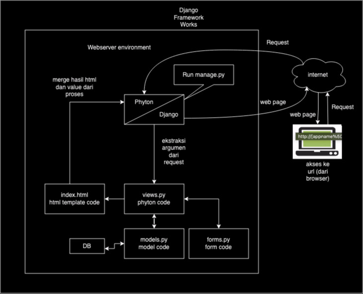
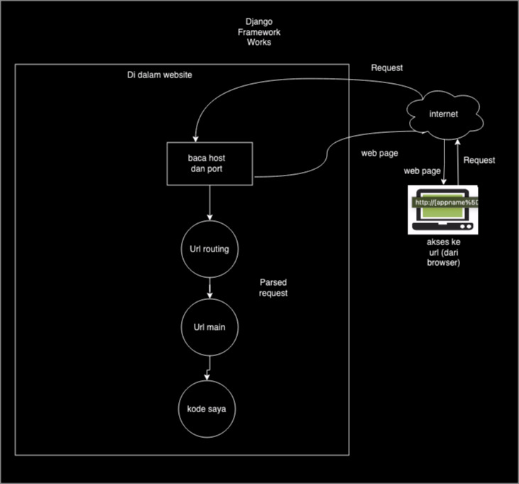

Nama    : Sabrina Atha Shania
NPM     : 2206829591
Kelas   : PBP A

Tautan link adaptable : https://galaxylibrary.adaptable.app

1. Jelaskan bagaimana cara kamu mengimplementasikan checklist di atas secara step-by-step (bukan hanya sekadar mengikuti tutorial).

    1. Membuat file dan repositori baru, lalu dilanjutkan dengan membuat django project

    2. Membuat aplikasi main dengan berikut tahapannya:
        - Membuat file HTML dengan isi web yang akan ditampilkan sesuai dengan tema yang diambil, yaitu "Pengelolaan koleksi perpustakaan"
        - Membuat class Books yang terdapat di dalam models.py untuk mendefinisikan data yang akan digunakan sebagai dasar dari database, diantaranya nama, jumlah, dan deskripsi
        - Membuat sebuah fungsi pada views.py yang dapat melakukan pengambilan data dari model maupun form dan dikembalikan ke dalam file HTML yang sudah dibuat
        - Meng-import models yang sudah dibuat sebelumnya ke dalam file views.py. Selanjutnya, memanggil fungsi model untuk menyimpan data baru ke dalam database. 
        - Pada views juga mengambil dan menyimpan nilai form yang telah di submit ke dalam database
        - Kemudian pada views akan melakukan render dengan books, form, dan context sebagai data yang akan dikembalikan ke dalam file HTML
        - Melakukan pemanggilan variabel detail dan form serta melakukan iterasi terhadap variabel books yang telah ikut di render ke dalam HTML.

    3. Membuat routing untuk memetakan fungsi yang telah dibuat pada views.py, berikut tahapannya:
        - Mendaftarkan aplikasi ke dalam urls.py yang terdapat pada folder another_world dengan menambahkan "path('main/', include('main.urls'))," pada variabel urlpatterns

    4. Melakukan deployment ke Adaptable terhadap aplikasi yang sudah dibuat sehingga dapat dibuka secara umum, berikut tahapannya:
        - Melakukan add, commit, dan push perubahan yang sudah dilakukan untuk menyimpannya ke dalam repositori GitHub
        - Deploy repository github ke dalam Adaptable dengan login, tekan tombol new app, memasukkan repository github, memilih python app_template sebagai template deployment, postgreSQL sebagai basis data, mengisi nama app, menambahkan command "python manage.py migrate && gunicorn shopping_list.wsgi", ceklis HTTP Listener on PORT, lalu deploy app
        - Apabila deployment berhasil, link aplikasi Adaptable sudah dapat dibuka oleh teman-teman

===========================================================================================================

2. Buatlah bagan yang berisi request client ke web aplikasi berbasis Django beserta responnya dan jelaskan pada bagan tersebut kaitan antara urls.py, views.py, models.py, dan berkas html.

    Django framework

    

    Webserver work 

    

    - Kaitan antara urls.py dan views.py adalah urls.py akan mem-parse argumen dan diteruskan ke views.py yang terkait, kemudian views.py akan mengambil request tersebut dan memberikan web response.
   - Kaitan antara views.py dan berkas html adalah views.py akan mengambil template dari berkas html, kemudian template tersebut di-merge di views.py dan diolah serta digabungkan.
   - Kaitan antara views.py dan models.py adalah models.py akan mengambil data dan diberikan ke views.py.

   Kaitan antara urls.py, views.py, models.py, dan berkas html adalah urls.py yang bertugas mem-parse argumen dari user dan berkas html yang berisi template web akan memberikan outputnya ke views.py. Selanjutnya, ketika ada query pemanggilan data dari views.py, models.py akan menjembatani pemanggilan data ke database. Kemudian views.py akan menggabungkan dan mengolahnya sehingga menjadi satu halaman web yang utuh.

===========================================================================================================

3. Jelaskan mengapa kita menggunakan virtual environment? Apakah kita tetap dapat membuat aplikasi web berbasis Django tanpa menggunakan virtual environment?

    Virtual environment adalah sebuah alat untuk menjaga ruang terpisah untuk sebuah proyek dengan pustaka dan dependensi di satu tempat. Environment ini spesifik ke proyek tertentu dan tidak berinterfer dengan dependensi proyek lainnya. Berikut beberapa alasan mengapa kita menggunakan virtual environment:

    - Virtual environment memungkinkan untuk menginstal dan mengelola versi pustaka atau paket yang berbeda untuk setiap proyek tanpa khawatir tentang konflik dependensi. 
    - Virtual environment menghindari masalah dengan memastikan bahwa setiap proyek memiliki lingkungan sendiri yang mengisolasi dependensinya.
    - Virtual environment memungkinkan untuk menjaga kebersihan lingkungan pengembangan, sehingga dapat dengan mudah menghapus atau memperbarui dependensi yang tidak diperlukan tanpa memengaruhi lingkungan global sistem.
    - Virtual environment dapat bantu mereproduksi lingkungan pengembangan yang sama persis di berbagai mesin atau server. 
    - Virtual environment memungkinkan untuk bekerja dengan aman tanpa merusak sistem.

    Iya, Kita tetap dapat membuat aplikasi web berbasis Django tanpa menggunakan virtual environment, tetapi akan sulit, tidak efisien, tidak efektif, dan tidak produktif. Oleh karena itu, sangat disarankan untuk menggunakan virtual environment dalam pengembangan proyek Django. Melalui penggunakan virtual environment, akan menjadi praktik yang baik dalam pengembangan Django karena memberikan sejumlah keuntungan yang telah dijelaskan sebelumnya, seperti isolasi dependensi, menghindari konflik, dan menjaga kebersihan lingkungan pengembangan.

===========================================================================================================

4. Jelaskan apakah itu MVC, MVT, MVVM dan perbedaan dari ketiganya
    1. MVC atau dikenal sebagai Model View Controller adalah sebuah pola arsitektur atau desain dalam pengembangan perangkat lunak seperti membuat sebuah aplikasi dengan cara memisahkan kode menjadi tiga bagian yang terdiri dari:
        - Model
        Bagian yang bertugas untuk mengelola data seperti menyiapkan, mengatur, memanipulasi, dan mengorganisasikan data yang ada di database.
        - View
        Bagian yang bertugas untuk menampilkan informasi dalam bentuk Graphical User Interface (GUI) kepada user.
        - Controller
        Bagian yang bertugas sebagai perantara untuk menghubungkan serta mengatur model dan view agar dapat saling terhubung.
    2. MVT atau dikenal sebagai Model View Template adalah sebuah pola arsitektur atau desain yang digunakan dalam pengembangan web aplikasi, terutama dalam kerangka kerja web Django yang sangat populer untuk bahasa pemrograman Python. MVT ini dibagi menjadi 3 bagian yang terdiri dari:
        - Model
        Bagian yang bertugas untuk mengelola data seperti menyiapkan, mengatur, memanipulasi, dan mengorganisasikan data yang ada di database.
        - View
        Bagian yang bertugas untuk menampilkan informasi dalam bentuk Graphical User Interface (GUI) kepada user.
        - Template
        Bagian yang bertugas untuk untuk mengatur tampilan dan presentasi data dalam aplikasi web.
    3. MVVM atau yang dikenal sebagai Model-View-ViewModel merupakan pola arsitektur atau desain (design pattern) yang digunakan dalam pengembangan perangkat lunak, terutama dalam pengembangan aplikasi berbasis antarmuka pengguna (UI) seperti aplikasi mobile dan aplikasi desktop. MVVM dibuat untuk memisahkan tanggung jawab dalam mengelola tampilan (UI) dari logika bisnis dalam aplikasi. MVVM ini dibagi menjadi 3 bagian yang terdiri dari:
        - Model
        Bagian yang bertugas untuk mengelola data seperti menyiapkan, mengatur, memanipulasi, dan mengorganisasikan data yang ada di database.
        - View
        Bagian yang bertugas untuk menampilkan informasi dalam bentuk Graphical User Interface (GUI) kepada user.
        - ViewModel
        Bagian yang bertugas sebagai perantara antara Model dan View dengan mengambil data dari Model dan memformatnya sedemikian rupa sehingga dapat dengan mudah ditampilkan di View. 

    Perbedaan Virtual environment ini terletak pada bagian ketiga dari MVC, MVT, dan MVVM
        - C pada MVC yaitu Controller yang bertindak sebagai perantara antara Model dan View. Mengatur aliran logika aplikasi dan menerima input dari pengguna.
        - T pada MVT yaitu Template yang digunakan untuk merender tampilan dan memisahkan tampilan data dalam aplikasi web.
        - VM pada MVVM yaitu View-Model yang bertindak sebagai perantara antara Model dan View dengan mengambil data dari Model dan memformatnya sehingga dapat dengan mudah ditampilkan di View. 
