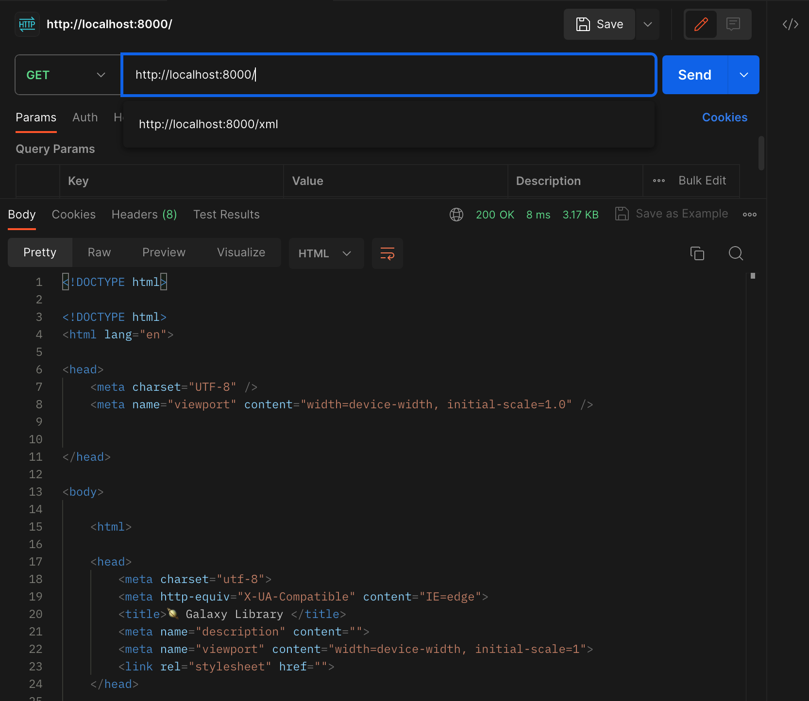
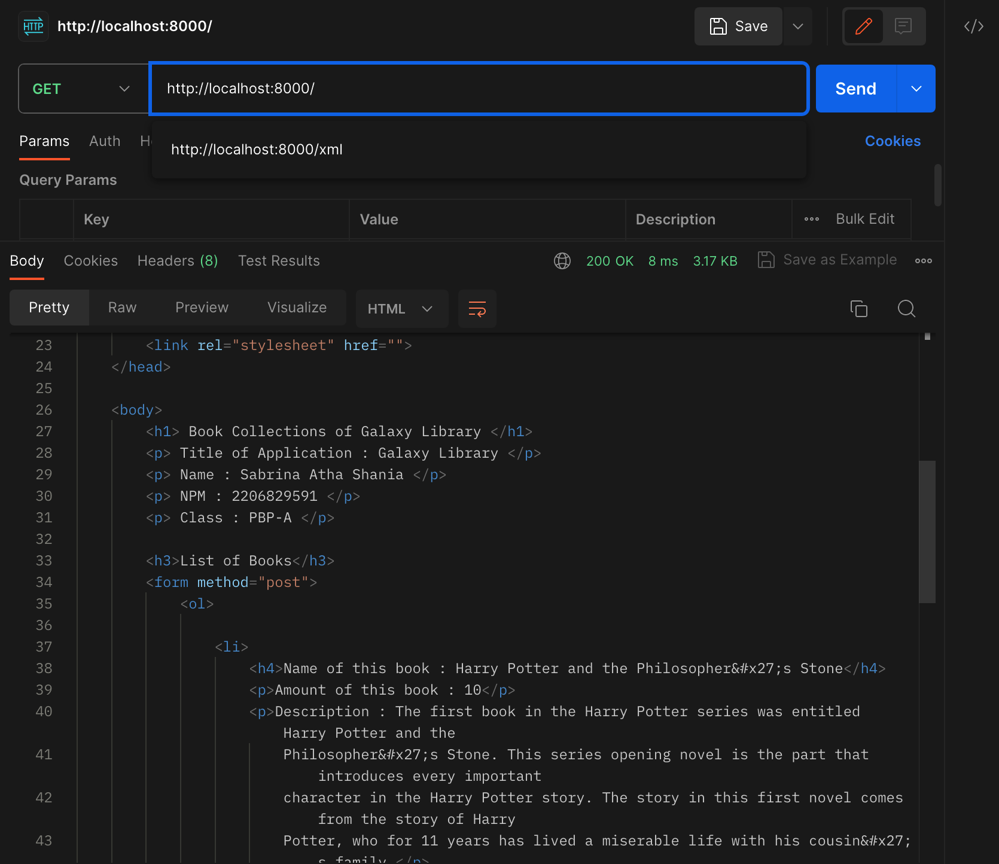
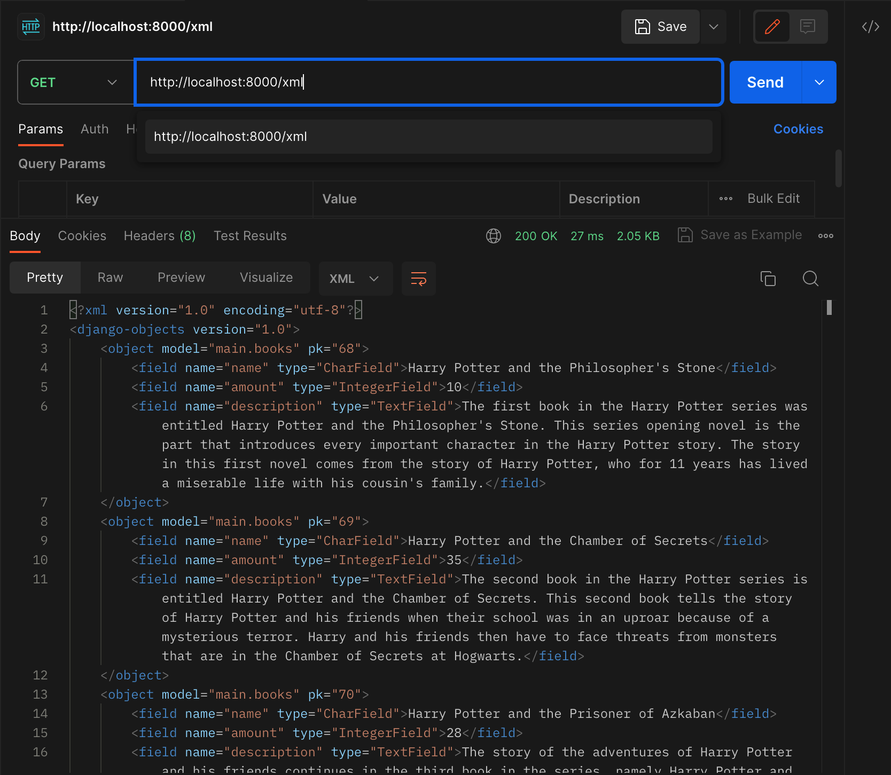
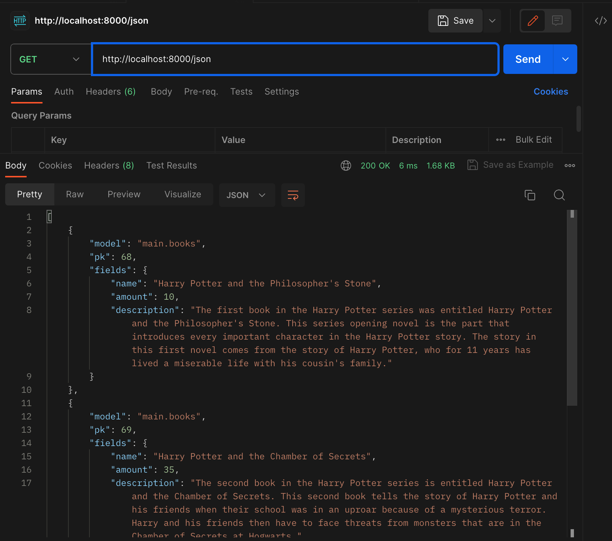
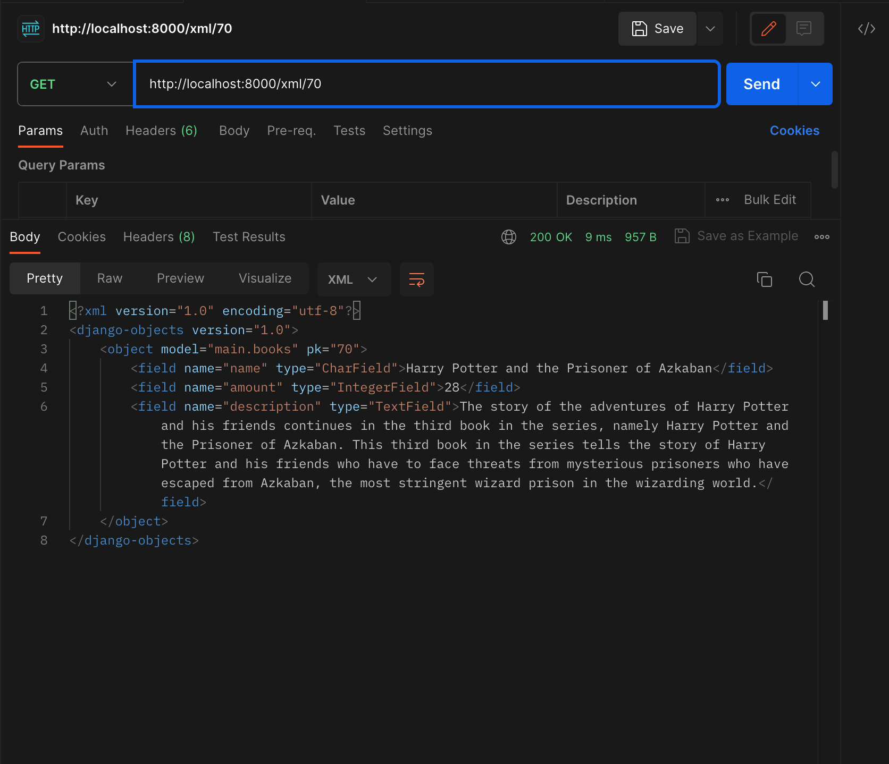
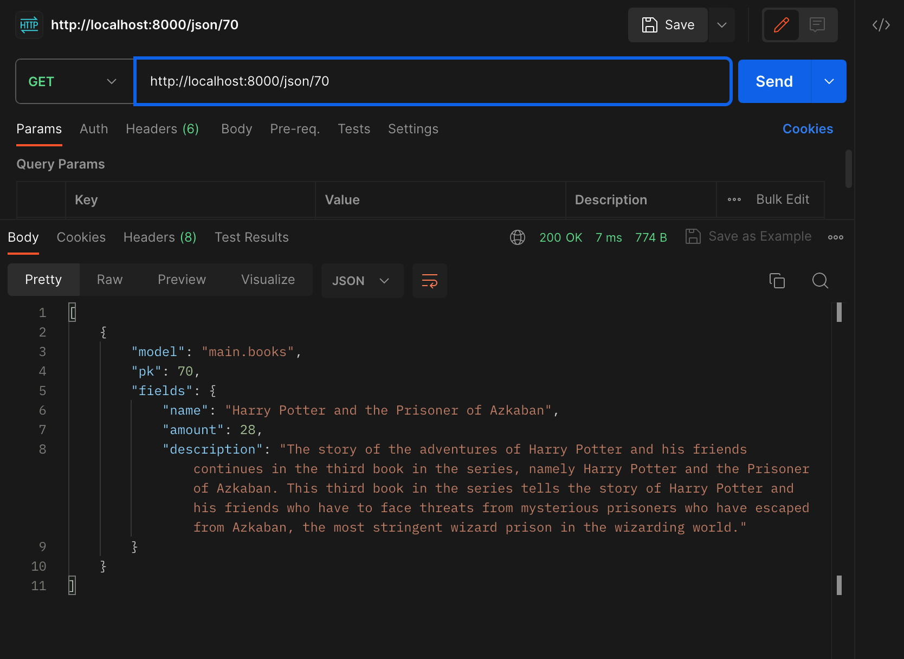

Nama    : Sabrina Atha Shania

NPM     : 2206829591

Kelas   : PBP A

------------------------------------------------ TUGAS 3 ------------------------------------------------

1. Apa perbedaan antara form POST dan form GET dalam Django?
    - Form POST digunakan untuk mengirim data dari formulir ke server untuk mengolahnya, seperti menambahkan data ke database atau mengirim pesan.
    - Form GET digunakan untuk melakukan pencarian, filter, atau mengambil data yang sudah ada tanpa mengirimkan data tambahan ke server.

    Perbedaan antara form POST dan form GET adalah :
    1.  POST :
        - Metode HTTP yang digunakan untuk mengirim data formulir ke server 
        - Data dikirim dalam tubuh permintaan HTTP, sehingga tidak terlihat dalam URL
        - Tidak ada batasan nyata pada panjang data yang dapat dikirimkan, sehingga cocok untuk mengirim data yang besar
        - Lebih aman karena data dikirim dalam metode HTTP yang tidak terlihat dalam URL
        - Tidak cocok untuk permintaan yang dapat dibookmark karena data tidak terlihat dalam URL, sehingga tidak dapat menyimpan URL dan mengaksesnya kembali dengan parameter yang sama
        - Biasanya tidak dapat di-cache karena setiap permintaan POST dianggap unik

    2. GET :
        - Metode HTTP yang digunakan untuk mengambil data dari server
        - Data dikirim sebagai parameter di URL, sehingga terlihat dalam URL
        - Panjang URL memiliki batasan, yang dapat berbeda-beda tergantung pada server web dan peramban, sehingga GET lebih cocok ketika data pendek dan sederhana
        - Kurang aman karena data dikirim dalam metode HTTP yang terlihat dalam URL
        - Cocok untuk permintaan yang dapat dibookmark karena data terlihat dalam URL, sehingga pengguna dapat menyimpan URL dan mengaksesnya kembali dengan parameter yang sama
        - Dapat di-cache oleh beberapa peramban atau server proxy karena data terlihat dalam URL

===========================================================================================================

2. Apa perbedaan utama antara XML, JSON, dan HTML dalam konteks pengiriman data?
    - XML(eXtensible Markup Language) adalah bahasa markup yang digunakan untuk mendefinisikan dan mengorganisir data terstruktur. XML digunakan untuk menyimpan, mengirim, dan mengolah data dalam format hierarkis yang dapat disesuaikan dengan kebutuhan aplikasi.
    - JSON (JavaScript Object Notation) adalah format pertukaran data yang berfokus pada objek dan array. JSON dirancang untuk menjadi ringkas dan mudah dibaca oleh manusia.
    - HTML (Hypertext Markup Language) adalah bahasa markup yang digunakan untuk membuat halaman web yang dapat ditampilkan oleh peramban web. HTML digunakan untuk mengatur tampilan dan struktur halaman web.

    1. XML
    - XML termasuk format serbaguna yang digunakan untuk menyimpan, mengirim, dan mengolah data terstruktur
    - XML memiliki sintaks yang ketat dan harus mengikuti aturan berhenti dan aturan penutupan tag, contoh:
    <person>
        <name>Tata</name>
        <age>19</age>
    </person>
    - XML digunakan dalam berbagai konteks, termasuk pertukaran data antara aplikasi, konfigurasi, penyimpanan data, dan lain lain
    - XML lebih fleksibel dan mendukung tipe data yang lebih beragam dan lebih kompleks daripada JSON dalam hal representasi data terstruktur.

    2. JSON
    - JSON lebih ringkas daripada XML dan lebih mudah dibaca oleh manusia
    - JSON memiliki sintaks yang lebih ringkas dan sederhana dengan pasangan nama-nilai yang menggunakan tanda titik dua, contoh:
    {
        "name": "Tata",
        "age": 19
    }
    - JSON digunakan secara luas dalam API web untuk pertukaran data antara server dan klien, konfigurasi dan penyimpanan data terstruktur
    - JSON lebih ringkas dan lebih efisien dalam hal ukuran data, mudah dipahami oleh manusia, dan lebih sering digunakan dalam kasus pertukaran data ringan

    3. HTML
    - HTML tidak digunakan untuk pengiriman data secara langsung tetapi digunakan untuk merender halaman web, menampilkan teks, gambar, tautan, dan lainnya.
    - HTML enggunakan elemen dan tag markup seperti 
 (paragraf),  (gambar), dan <a> (tautan)
    - HTML digunakan untuk membuat halaman web yang dapat dilihat oleh peramban web dan diakses oleh pengguna

===========================================================================================================

3. Mengapa JSON sering digunakan dalam pertukaran data antara aplikasi web modern?
    JSON (JavaScript Object Notation) sering digunakan dalam pertukaran data antara aplikasi web modern karena memiliki keunggulan keunggulan dibandingkan yang lainnya dan menjadikannya pilihan yang sangat baik dalam lingkungan ini, diantaranya sebagai berikut.

    - Ringkas dan Mudah Dibaca
    Data dalam JSON direpresentasikan sebagai pasangan nama-nilai, yang membuatnya sangat intuitif, sehingga pengembang dapat dengan cepat memahami struktur data.

    - Bahasa Agnostik
    JSON tidak terikat pada bahasa pemrograman tertentu. Pengembang dapat menghasilkan dan mengonsumsi data JSON dari berbagai bahasa pemrograman yang berbeda. Sebagai contoh, data JSON yang dihasilkan oleh server dapat digunakan oleh klien yang ditulis dalam bahasa pemrograman JavaScript, Python, Java, C#, dan lain-lain.

    - Dukungan Browser Built-in
    Banyak peramban web modern memiliki dukungan bawaan (built-in) untuk parsing dan menghasilkan data JSON, sehingga JSON menjadi pilihan yang ideal untuk berkomunikasi antara peramban dan server web tanpa perlu menggunakan teknik atau pustaka tambahan.

    - Efisiensi dan Kecilnya Ukuran Data
    JSON adalah format data yang ringan. Data yang dikirim dalam format JSON biasanya memiliki ukuran yang lebih kecil, sehingga dapat mengurangi beban jaringan dan mempercepat pertukaran data.

    - Kompatibilitas dengan JavaScript
    JSON sangat cocok dengan bahasa pemrograman JavaScript, yang digunakan secara luas dalam pengembangan web. Hal ini menyebabkan JSON mudah digunakan dalam pengembangan aplikasi berbasis web, termasuk aplikasi single-page (SPA) yang populer.

    - Mendukung Struktur Data Terstruktur
    JSON mendukung berbagai jenis data terstruktur, termasuk objek, array, string, angka, boolean, dan nilai-nilai null. Sehingga, aman untuk merepresentasikan data yang lebih kompleks dan fleksibel.

    - Digunakan dalam RESTful API
    JSON adalah format pertukaran data yang standar dalam arsitektur RESTful API (Application Programming Interface). API web modern sering menggunakan JSON sebagai format data yang diterima dan dikirimkan oleh server.

    - Komunitas dan Dukungan
    JSON telah menjadi standar de facto dalam pertukaran data dalam pengembangan web, dan ada banyak dukungan komunitas dan pustaka untuk mengolah data JSON di berbagai bahasa pemrograman.

===========================================================================================================

4. Jelaskan bagaimana cara kamu mengimplementasikan checklist di atas secara step-by-step (bukan hanya sekadar mengikuti tutorial).
    1. Membuat input form 
        - Menambahkan extend base.html pada main.html
        - Menambahkan file baru bernama forms.py pada main dan menambahkan kode didalamnya
        - Menambahkan tambahan import pada views.py dan membuat fungsi baru bernama create_books untuk menghasilkan formulir yang dapat menambahkan data produk secara otomatis ketika data di-submit dari form
        - Mengubah render pada fungsi show_main dalam views menjadi 
        return render(request, "main.html", {'books': books, 'detail' : context})
        - Routing dengan mengimport fungsi create_books ke urls.py pada folder main
        - Menambahkan path url routing create_books ke dalam urlpatterns
        - Buat berkas html baru dengan nama create_books untuk mengisi form dan submit
        - Menambahkan kode untuk menampilkan data produk hasil dari form serta tombol "Add New Book" yang akan redirect ke halaman form.
    
    2. Menambahkan 5 fungsi pada views.py dalam folder main (show_main, show_xml, show_json, show_xml_by_id, show_json_by_id)
        - Dalam tiap fungsi ditambahkan kode berikut
        data = Books.objects.all() (HTML, XML, JSON)
        data = Books.objects.filter(pk=id) (XML_by_id, JSON_by_id)
        - Menambahkan return function berupa HttpResponse yang berisi parameter data hasil query yang sudah diserialisasi
    
    3. Membuat routing URL untuk masing-masing views yang telah ditambahkan pada poin 2.
        - Mengimpor fungsi (show_main, show_xml, show_json, show_xml_by_id, show_json_by_id) pada urls.py yang ada pada folder main
        - Tambahkan path url ke dalam urlpatterns untuk mengakses fungsi yang sudah diimpor
    
    4. Menjawab pertanyaan di dalam file README.md
    5. Mengakses kelima URL menggunakan Postman
    6. Melakukan git workflow (add, commit, push)

===========================================================================================================

5. Hasil Screenshot postman
    - HTML

    
    

    - XML
    

    - JSON
    

    - XML by id
    

    - JSON by id
    

------------------------------------------------ TUGAS 2 ------------------------------------------------
Tautan link adaptable : https://galaxylibrary.adaptable.app

1. Jelaskan bagaimana cara kamu mengimplementasikan checklist di atas secara step-by-step (bukan hanya sekadar mengikuti tutorial).

    1. Membuat file dan repositori baru, lalu dilanjutkan dengan membuat django project

    2. Membuat aplikasi main dengan berikut tahapannya:
        - Membuat file HTML dengan isi web yang akan ditampilkan sesuai dengan tema yang diambil, yaitu "Pengelolaan koleksi perpustakaan"
        - Membuat class Books yang terdapat di dalam models.py untuk mendefinisikan data yang akan digunakan sebagai dasar dari database, diantaranya nama, jumlah, dan deskripsi
        - Membuat sebuah fungsi pada views.py yang dapat melakukan pengambilan data dari model maupun form dan dikembalikan ke dalam file HTML yang sudah dibuat
        - Meng-import models yang sudah dibuat sebelumnya ke dalam file views.py. Selanjutnya, memanggil fungsi model untuk menyimpan data baru ke dalam database. 
        - Pada views juga mengambil dan menyimpan nilai form yang telah di submit ke dalam database
        - Kemudian pada views akan melakukan render dengan books, form, dan context sebagai data yang akan dikembalikan ke dalam file HTML
        - Melakukan pemanggilan variabel detail dan form serta melakukan iterasi terhadap variabel books yang telah ikut di render ke dalam HTML.

    3. Membuat routing untuk memetakan fungsi yang telah dibuat pada views.py, berikut tahapannya:
        - Mendaftarkan aplikasi ke dalam urls.py yang terdapat pada folder another_world dengan menambahkan "path('main/', include('main.urls'))," pada variabel urlpatterns

    4. Melakukan deployment ke Adaptable terhadap aplikasi yang sudah dibuat sehingga dapat dibuka secara umum, berikut tahapannya:
        - Melakukan add, commit, dan push perubahan yang sudah dilakukan untuk menyimpannya ke dalam repositori GitHub
        - Deploy repository github ke dalam Adaptable dengan login, tekan tombol new app, memasukkan repository github, memilih python app_template sebagai template deployment, postgreSQL sebagai basis data, mengisi nama app, menambahkan command "python manage.py migrate && gunicorn shopping_list.wsgi", ceklis HTTP Listener on PORT, lalu deploy app
        - Apabila deployment berhasil, link aplikasi Adaptable sudah dapat dibuka oleh teman-teman

===========================================================================================================

2. Buatlah bagan yang berisi request client ke web aplikasi berbasis Django beserta responnya dan jelaskan pada bagan tersebut kaitan antara urls.py, views.py, models.py, dan berkas html.

    Django framework

    

    Webserver work 

    

    - Kaitan antara urls.py dan views.py adalah urls.py akan mem-parse argumen dan diteruskan ke views.py yang terkait, kemudian views.py akan mengambil request tersebut dan memberikan web response.
   - Kaitan antara views.py dan berkas html adalah views.py akan mengambil template dari berkas html, kemudian template tersebut di-merge di views.py dan diolah serta digabungkan.
   - Kaitan antara views.py dan models.py adalah models.py akan mengambil data dan diberikan ke views.py.

   Kaitan antara urls.py, views.py, models.py, dan berkas html adalah urls.py yang bertugas mem-parse argumen dari user dan berkas html yang berisi template web akan memberikan outputnya ke views.py. Selanjutnya, ketika ada query pemanggilan data dari views.py, models.py akan menjembatani pemanggilan data ke database. Kemudian views.py akan menggabungkan dan mengolahnya sehingga menjadi satu halaman web yang utuh.

===========================================================================================================

3. Jelaskan mengapa kita menggunakan virtual environment? Apakah kita tetap dapat membuat aplikasi web berbasis Django tanpa menggunakan virtual environment?

    Virtual environment adalah sebuah alat untuk menjaga ruang terpisah untuk sebuah proyek dengan pustaka dan dependensi di satu tempat. Environment ini spesifik ke proyek tertentu dan tidak berinterfer dengan dependensi proyek lainnya. Berikut beberapa alasan mengapa kita menggunakan virtual environment:

    - Virtual environment memungkinkan untuk menginstal dan mengelola versi pustaka atau paket yang berbeda untuk setiap proyek tanpa khawatir tentang konflik dependensi. 
    - Virtual environment menghindari masalah dengan memastikan bahwa setiap proyek memiliki lingkungan sendiri yang mengisolasi dependensinya.
    - Virtual environment memungkinkan untuk menjaga kebersihan lingkungan pengembangan, sehingga dapat dengan mudah menghapus atau memperbarui dependensi yang tidak diperlukan tanpa memengaruhi lingkungan global sistem.
    - Virtual environment dapat bantu mereproduksi lingkungan pengembangan yang sama persis di berbagai mesin atau server. 
    - Virtual environment memungkinkan untuk bekerja dengan aman tanpa merusak sistem.

    Iya, Kita tetap dapat membuat aplikasi web berbasis Django tanpa menggunakan virtual environment, tetapi akan sulit, tidak efisien, tidak efektif, dan tidak produktif. Oleh karena itu, sangat disarankan untuk menggunakan virtual environment dalam pengembangan proyek Django. Melalui penggunakan virtual environment, akan menjadi praktik yang baik dalam pengembangan Django karena memberikan sejumlah keuntungan yang telah dijelaskan sebelumnya, seperti isolasi dependensi, menghindari konflik, dan menjaga kebersihan lingkungan pengembangan.

===========================================================================================================

4. Jelaskan apakah itu MVC, MVT, MVVM dan perbedaan dari ketiganya
    1. MVC atau dikenal sebagai Model View Controller adalah sebuah pola arsitektur atau desain dalam pengembangan perangkat lunak seperti membuat sebuah aplikasi dengan cara memisahkan kode menjadi tiga bagian yang terdiri dari:
        - Model
        Bagian yang bertugas untuk mengelola data seperti menyiapkan, mengatur, memanipulasi, dan mengorganisasikan data yang ada di database.
        - View
        Bagian yang bertugas untuk menampilkan informasi dalam bentuk Graphical User Interface (GUI) kepada user.
        - Controller
        Bagian yang bertugas sebagai perantara untuk menghubungkan serta mengatur model dan view agar dapat saling terhubung.
    2. MVT atau dikenal sebagai Model View Template adalah sebuah pola arsitektur atau desain yang digunakan dalam pengembangan web aplikasi, terutama dalam kerangka kerja web Django yang sangat populer untuk bahasa pemrograman Python. MVT ini dibagi menjadi 3 bagian yang terdiri dari:
        - Model
        Bagian yang bertugas untuk mengelola data seperti menyiapkan, mengatur, memanipulasi, dan mengorganisasikan data yang ada di database.
        - View
        Bagian yang bertugas untuk menampilkan informasi dalam bentuk Graphical User Interface (GUI) kepada user.
        - Template
        Bagian yang bertugas untuk untuk mengatur tampilan dan presentasi data dalam aplikasi web.
    3. MVVM atau yang dikenal sebagai Model-View-ViewModel merupakan pola arsitektur atau desain (design pattern) yang digunakan dalam pengembangan perangkat lunak, terutama dalam pengembangan aplikasi berbasis antarmuka pengguna (UI) seperti aplikasi mobile dan aplikasi desktop. MVVM dibuat untuk memisahkan tanggung jawab dalam mengelola tampilan (UI) dari logika bisnis dalam aplikasi. MVVM ini dibagi menjadi 3 bagian yang terdiri dari:
        - Model
        Bagian yang bertugas untuk mengelola data seperti menyiapkan, mengatur, memanipulasi, dan mengorganisasikan data yang ada di database.
        - View
        Bagian yang bertugas untuk menampilkan informasi dalam bentuk Graphical User Interface (GUI) kepada user.
        - ViewModel
        Bagian yang bertugas sebagai perantara antara Model dan View dengan mengambil data dari Model dan memformatnya sedemikian rupa sehingga dapat dengan mudah ditampilkan di View. 

    Perbedaan Virtual environment ini terletak pada bagian ketiga dari MVC, MVT, dan MVVM
        - C pada MVC yaitu Controller yang bertindak sebagai perantara antara Model dan View. Mengatur aliran logika aplikasi dan menerima input dari pengguna.
        - T pada MVT yaitu Template yang digunakan untuk merender tampilan dan memisahkan tampilan data dalam aplikasi web.
        - VM pada MVVM yaitu View-Model yang bertindak sebagai perantara antara Model dan View dengan mengambil data dari Model dan memformatnya sehingga dapat dengan mudah ditampilkan di View. 

